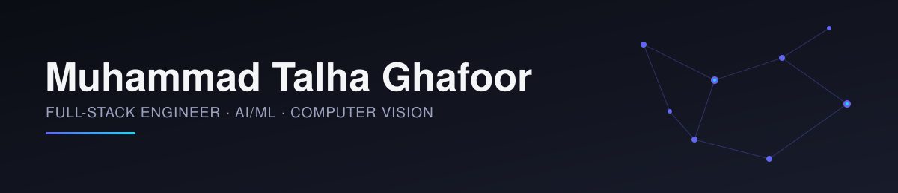

 

 

 

 

## About

I build AI systems that make it to production, not just notebooks — a biometric access-control engine using cosine similarity and margin-based matching, a hybrid ARIMA–LSTM forecasting model, and an OCR system for Urdu, a language with limited existing tooling.

Two years of freelance and industry work have shown me what actually breaks when models meet real users and real data. Right now I'm building a multi-tenant, SaaS-style event access platform that combines biometric face recognition with QR authentication, architected on FastAPI, PostgreSQL, and Qdrant.

 

## Focus Areas

- **Computer vision & biometrics** — face recognition, re-identification, pose estimation, embedding-based matching at scale
- **Applied ML & forecasting** — hybrid statistical/deep-learning models, churn prediction, recommender systems
- **Backend architecture** — multi-tenant systems, vector databases, RESTful and real-time APIs
- **Automation & integrations** — n8n workflows tying together CRMs, e-signature, and cloud AI services

 

## Tech Stack

**AI / ML**

**Backend & APIs**

**Data & Infrastructure**

Also working with: **Qdrant** (vector search), **MLflow**, **PySpark**

 

## Experience

| Role | Client / Company | Period | Highlight |
|---|---|---|---|
| Freelance Software Engineer | Event Access Platform · Spain | 01/2026 – Present | Multi-tenant biometric + QR event access SaaS on FastAPI/PostgreSQL/Qdrant |
| Freelance Automation Engineer | Sales Agreement Automation · USA | 05/2026 – 06/2026 | End-to-end n8n workflow: JotForm → BoldSign → GoHighLevel → Google Drive |
| Freelance Software Engineer | Face Recognition Automation · USA | 11/2025 – 12/2025 | n8n + AWS Rekognition pipeline with WhatsApp-based verification |
| Freelance Software Engineer | Wildlife Re-ID App · Laos | 08/2025 – 10/2025 | CNN-based bear re-identification for a citizen-science conservation app |
| Freelance CV Engineer | Fitness Form Analysis · Germany | 03/2025 – 04/2025 | MediaPipe/OpenPose pipeline scoring workout form against reference keypoints |
| Jr. Software Engineer | EZMD Solutions · Pakistan | 10/2024 – 07/2025 | RESTful APIs on Node.js/Express; 30% less downtime, 25% faster queries |

 

## Featured Projects

**[Urdu OCR Text Recognition](https://github.com/talha081/URDU-OCR-ML-PROJECT)**
Synthetic dataset generation and augmentation pipeline (erosion, dilation, rotation, noise) for a low-resource language OCR system.

**Patient Communication Platform** — *client delivery*
HIPAA-compliant telehealth platform (MERN + React Native) with encrypted chat, video calls, and real-time EHR access — serving 1,000+ active users.

**Sales Forecasting with Hybrid ARIMA–LSTM**
Combined ARIMA for trend/seasonality with LSTM for nonlinear dependencies to support inventory and revenue planning.

**Customer Churn Prediction**
Logistic Regression, Decision Trees, and Random Forests compared to flag at-risk customers — 90% prediction accuracy.

 

## Contribution Activity

<picture>
  <source media="(prefers-color-scheme: dark)" srcset="https://raw.githubusercontent.com/talha081/talha081/output/github-contribution-grid-snake-dark.svg" />
  <source media="(prefers-color-scheme: light)" srcset="https://raw.githubusercontent.com/talha081/talha081/output/github-contribution-grid-snake.svg" />
  
</picture>

 

## Trophies

 

Open to remote AI/ML, backend, and computer-vision roles.
Reach out via [email](mailto:talha.ghafoor1209@gmail.com) or take a look at my [portfolio](https://talha-ghafoor.vercel.app/).

